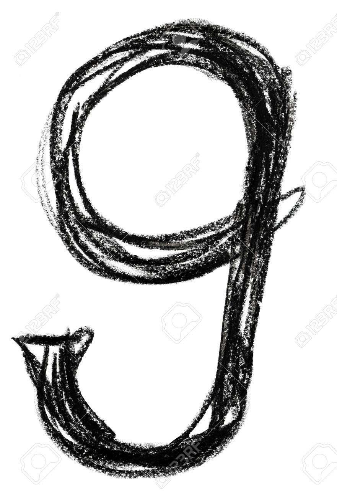
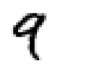
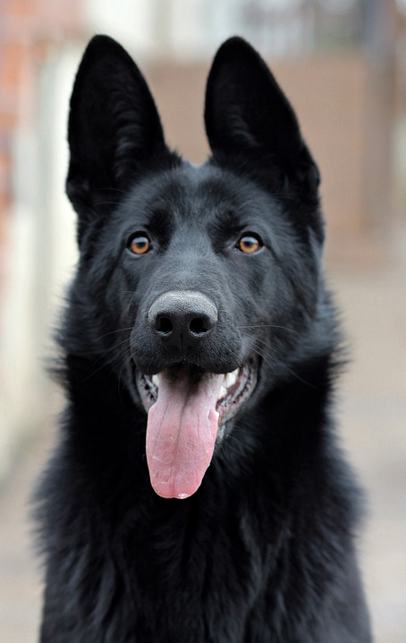
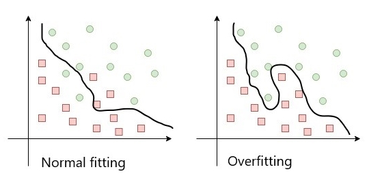
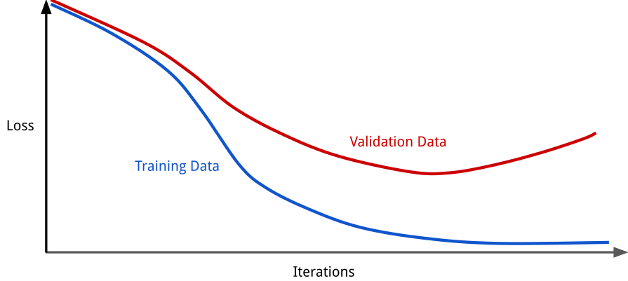

If you are reading this post, then you want to learn about overfitting as soon as possible. Let me not go into technical details yet, but tell you a little occasion that happened to me. I was born and lived in Armenia all my life. This month, I arrived in Vancouver to pursue Master of Data Science degree in UBC. I thought that I might experience some confusion in a new country, but that confusion came from the place which I didn't expect. **I confused handwritten digit 9 with 4!!**

The reason behind this was the difference in how people write digits 9 and 4 in Canada and Armenia. In Canada, people do not have the curvy ending at the bottom of the number 9. First two pictures below represent how people write digit nine in Armenia (left) and in Canada (middle). The third picture depicts how people in Armenia write digit 4 (right). 

   

       
       
       
   

   
My brain classified the digit 9 as 4, which is not so surprising when we compare the middle picture to ones next to it. And here is the right place, where we can integrate the term *\"overfitting\"*. My brain was overfitted to the set of handwritten digits of Armenia, so that I couldn't correctly identify the handwritten number 9 that I saw in Canada.

Let's take this analogy to the universe of computers. Imagine, we want to train a machine learning model, which should classify dogs and cats. After gathering data, we see that in our dataset, dogs have black color, and the background is bright. On the other hand, almost all cats in our dataset are white and captured in the black background. Here are two examples from each:

   

       
       
       
       
   

   
Surprisingly, we get very high accuracy on the train data! It reaches 99%, and we are happy! But when it comes testing our model, we find out that something is wrong. On the testing data, our model gives 20% of accuracy, which is even worse than a random guess!! We also learn that our model predicts white dogs as cats and black cats as dogs. Such a difference in training and the testing accuracy is actually *overfitting*, and one of the causes of it, is the insufficient number of training examples from each class. In this example, our training data had in it just black dogs and white cats, whereas not all dogs are black and not all cats are white.

Following is a more technical definition of *overfitting*. **Overfitted model is one whose results almost exactly equal to the true values of a set of data, and fails to have good results on additional data or predict future observations reliably.**

Usually, any dataset has some samples in it that don't follow the general rule. These samples are called *\"noise.\"* *Overfitting* happens with the models that try to learn some patterns from the noise too. This increases train accuracy, but as "noise" is just a random variation of the data, learning that patterns decrease test accuracy. Below is the visualization of the noise and overfitted model.

   

[source of the visualization](https://subscription.packtpub.com/book/big_data_and_business_intelligence/9781789345377/1/ch01lvl1sec14/comparing-underfitting-and-overfitting)

### Detecting overfitting:

In machine learning, the aim of the model is to learn from training data. There is so-called validation data, which is used to validate the accuracy of the model with another dataset. So, after each learning step, the training accuracy and validation accuracy are computed. As the noise exists, starting from some point, the model will start to learn some patterns from the noise too. Thus, the generalization of the model will drop, but the training accuracy will get higher. It is easy to interpret the error term of training and validation datasets and analyze their plots.

   

[source of the visualization](https://developers.google.com/machine-learning/crash-course/regularization-for-simplicity/l2-regularization)

Starting from the point, where the validation error starts to increase, overfitting is unavoidable. We, however, are interested in the point where validation error is the least. By analyzing the accuracy gap between training and validation datasets, it can be derived, do we have overfitting or not. **There is no defined general measurement of overfitting. Depending on the dataset and other factors, in one case 5% of the difference between training and testing accuracy may be normal, while in another case may be considered as overfitting.**

### Reasons of overfitting:

There are multiple reasons for overfitting. Mostly, it is caused by three factors:

- Not representative training dataset (example was dogs and cats classifier)
- Too complex model
- Not enough training samples

The first point was already discussed. The training dataset, in our case, was not representing all possible occasions of dogs and cats. Thus, the model trained only on the given data gave poor testing scores. 

Models that are too complex, have more parameters and tend to learn patterns easier. If the data is clean(without noise) and representative, this will not create any issues. Moreover, as complex, the model is, as better it will learn. However, in almost all real-life datasets, there is a noise. Therefore, the complexity of the model should be increased carefully, not to overfit.

If the model is trained with a small amount of data, it usually finds trivial patters that give good results for the training dataset. However, a small number of the dataset cannot be sufficient to generalize the model, thus it performs badly on testing set.

### Deal with overfitting:

Most of the times, overfitting is solved by:

- Increasing training dataset
- Decreasing complexity of the model

The first one is achieved either by gathering new data or by *\"augmentation.\"* In two words, *augmentation* is a technique which is used to created new data from ones that already we have. For example, flipping, rotating or changing colors of the image.

The second one is achieved in lots of different ways, one of which is *regularization*. Again, in two words, *regularization* pushes the parameters of the model towards 0 and prevents them from learning. If the regularization parameter is well defined, overfitting will be solved, and the model will still produce good results.

### Final remarks:

Dealing with overfitting may be hard. The concepts discussed in that section are complex and need more effort to understand. A very good resource for *augmentation* can be found [here](https://nanonets.com/blog/data-augmentation-how-to-use-deep-learning-when-you-have-limited-data-part-2/) and for knowing more about regularization I recommend to take a look [here](https://towardsdatascience.com/regularization-in-machine-learning-76441ddcf99a).

### Sources:
1. https://elitedatascience.com/overfitting-in-machine-learning
2. https://www.datarobot.com/wiki/overfitting/
3. https://nanonets.com/blog/data-augmentation-how-to-use-deep-learning-when-you-have-limited-data-part-2/
4. https://towardsdatascience.com/regularization-in-machine-learning-76441ddcf99a
